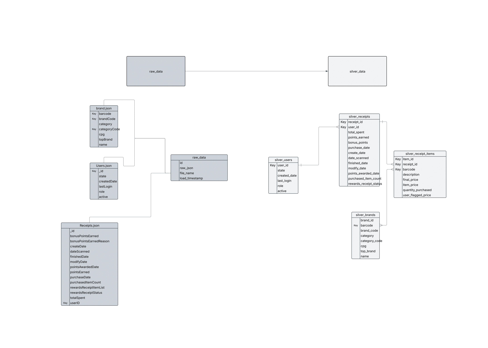

  


# Fetch Rewards Coding Exercise - Analytics Engineer

## First: Review Existing Unstructured Data and Diagram a New Structured Relational Data Model

Review the 3 sample data files provided below. Develop a simplified, structured, relational diagram to represent how you would model the data in a data warehouse. The diagram should show each table’s fields and the joinable keys. You can use pencil and paper, readme, or any digital drawing or diagramming tool with which you are familiar. If you can upload the text, image, or diagram into a git repository and we can read it, we will review it!

### Answer:

In response to the 3 sample data files located in the directory file `json_data`, I have constructed a structured relational data model that articulates how I would store the data in a RDBMS database.

I chose a relational database model for its ability to enforce data integrity, ensure efficient joins across normalized tables, and support scalable analytical queries. This structured approach allows for robust data transformations and streamlined reporting.



For the purposes of this exercise and enabling robust data analysis and engineering, I executed this database in a local SQLite database instance. In this repository, you will find the `.db` file if you navigate to the `sqlite_db` folder.

A quick and convenient way to explore this database and test the queries in later parts of this exercise is to install **DB Browser for SQLite** https://sqlitebrowser.org/ and navigate to the *Execute SQL* tab within the application.

---

## Second: Write Queries That Directly Answer Predetermined Questions from a Business Stakeholder

Write SQL queries against your new structured relational data model that answer at least two of the following bullet points below of your choosing. Commit them to the git repository along with the rest of the exercise.

**Selected Queries:**

### What are the top 5 brands by receipts scanned for most recent month?
### How does the ranking of the top 5 brands by receipts scanned for the recent month compare to the ranking for the previous month?

```sql
WITH month_ranked AS (
    SELECT 
        strftime('%Y-%m', date_scanned) AS purchase_month,
        RANK() OVER (ORDER BY MAX(date_scanned) DESC) AS month_rank
    FROM silver_receipts
    GROUP BY purchase_month
),
brand_ranking AS (
    SELECT 
        sb.brand_id,
        sb.name AS brand_name,
        strftime('%Y-%m', sr.date_scanned) AS purchase_month,
        COUNT(sr.receipt_id) AS total_receipts,
        RANK() OVER (PARTITION BY strftime('%Y-%m', sr.date_scanned) ORDER BY COUNT(sr.receipt_id) DESC) AS rank
    FROM silver_receipts sr
    JOIN silver_receipt_items sri ON sr.receipt_id = sri.receipt_id
    JOIN silver_brands sb ON sri.barcode = sb.barcode
    GROUP BY sb.brand_id, sb.name, purchase_month
)
SELECT * 
FROM brand_ranking
ORDER BY purchase_month DESC, rank;
```

---

### When considering average spend from receipts with `rewardsReceiptStatus` of `Accepted` or `Rejected`, which is greater?
### When considering total number of items purchased from receipts with `rewardsReceiptStatus` of `Accepted` or `Rejected`, which is greater?

```sql
SELECT 
    strftime('%Y-%m', sr.date_scanned) as scanned_month,
    sr.rewards_receipt_status,
    COALESCE(AVG(NULLIF(sr.total_spent, 0)), 0) AS avg_spent, 
    COALESCE(SUM(sri.quantity_purchased), 0) AS total_items_purchased
FROM silver_receipts sr
LEFT JOIN silver_receipt_items sri ON sr.receipt_id = sri.receipt_id
GROUP BY strftime('%Y-%m', sr.date_scanned), sr.rewards_receipt_status;
```

---

## Third: Evaluate Data Quality Issues in the Data Provided

Using the programming language of your choice (SQL, Python, R, Bash, etc.) identify as many data quality issues as you can. We are not expecting a full-blown review of all the data provided but instead want to know how you explore and evaluate data of questionable provenance.

### Answer:

- **Null barcodes result in missing opportunities to tie to brands.**

```sql
SELECT
    strftime('%Y-%m', sr.purchase_date) AS purchase_month,
    CASE 
        WHEN sri.barcode IS NULL THEN 'is_null' 
        WHEN sri.barcode IS NOT NULL AND sb.brand_id IS NULL THEN 'barcode_no_brand'
        WHEN sri.barcode IS NOT NULL AND sb.brand_id IS NOT NULL THEN 'barcode_w_brand'
    END AS barcode_status,
    COUNT(*) AS total_count
FROM silver_receipts AS sr
LEFT JOIN silver_receipt_items AS sri ON sr.receipt_id = sri.receipt_id
LEFT JOIN silver_brands AS sb ON sri.barcode = sb.barcode
GROUP BY purchase_month, barcode_status
ORDER BY purchase_month DESC;
```

- **55.48% of scanned items are missing barcodes, impacting analysis.**

```sql
SELECT 
    COUNT(*) AS total_receipt_items,
    SUM(CASE WHEN sri.barcode IS NULL THEN 1 ELSE 0 END) AS missing_barcodes,
    ROUND(SUM(CASE WHEN sri.barcode IS NULL THEN 1 ELSE 0 END) * 100.0 / COUNT(*), 2) AS percent_missing
FROM silver_receipt_items sri;
```

- **There appears to be a very low amount of receipt_item barcodes that match the brand database.**

```sql
select DISTINCT
		sri.barcode,
		count(sb.brand_code) as count
from silver_receipt_items sri
inner join silver_brands sb on sri.barcode = sb.barcode
group by sri.barcode
order by count desc
```

- **There are discrepancies between date_scanned and purchase_month on the receipts data. Wondering how these different dates are being gathered in the system?**

```sql
select 
    strftime('%Y-%m', sr.purchase_date) AS purchase_month,
	count(*) 
from silver_receipts sr
group by strftime('%Y-%m', sr.purchase_date)
order by strftime('%Y-%m', sr.purchase_date) desc;
```

```sql
select 
    strftime('%Y-%m', sr.date_scanned) AS date_scanned,
	count(*) 
from silver_receipts sr
group by strftime('%Y-%m', sr.date_scanned)
order by strftime('%Y-%m', sr.date_scanned) desc
```

---

## Fourth: Communicate with Stakeholders

Construct an email or Slack message that is understandable to a product or business leader who isn’t familiar with your day-to-day work.

### Answer:

```
Hello [insert name of business leader here],
Firstly, thank you for sharing this data with me. I’ve spent time reviewing it and would like an opportunity to better understand how the data is being gathered and what controls are in place for that data. Would you be willing to meet with me or put me in contact with subject matter experts on these topics?

Questions I have are:
•	What is the lifecycle of a receipt from the moment of being scanned to a final “resting” place in our data? What different timestamps are being recorded in the system and how are they recorded?
•	How is the receipt data being scanned? What kind of controls are in place to ensure that the data ingested is clean? 
•	How are we gathering our barcode database that maintains the barcode associations? Are we doing any sort of Quality Assurance to make sure the relationship of barcode/brand is 1:1. Is there an automated effort in place to update these relationships and retire previous relationships in a historical table? I have identified that 55.48% of receipt items have missing barcodes, impacting our ability to track brand performance.
•	Executing this workflow into production seems feasible from my initial analysis of the data provided. Concurrent read/writes on the database will be a concern. I will need more information on what scaling the platform offers and if we can find a way to scale our compute with the amount of traffic we are receiving from the application. 
Appreciate your time on this matter and look forward to hearing back. 
Best,
Nicholas Kreuziger
```
